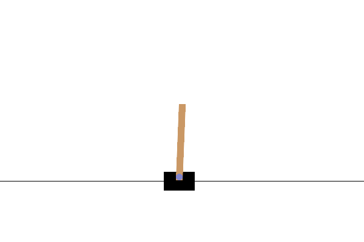
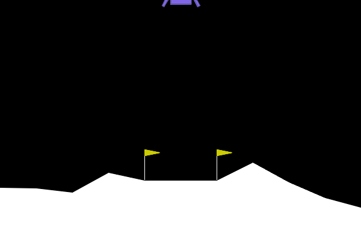

# Reinforcement Learning Collection: A2C Algorithm

This repository contains implementations of the **A2C (Advantage Actor-Critic)** reinforcement learning algorithm applied to classic control environments using **Stable-Baselines3** and **OpenAI Gymnasium**. The project focuses on solving discrete action space problems by leveraging policy-based learning.

---

## 📂 Project Structure

The project is organized by environment type. Each folder contains the training script, the saved model, and a visual demonstration of the agent's performance.

### 1. CartPole
Located in the `Actor-Critic/CartPole/` directory. The goal is to balance a pole on a moving cart for as long as possible.

* **Environments:** `CartPole-v1`
* **Core Files:**
    * `CartPoleWithA2C.py`: Main script for training and inference.
    * `A2C_CartPole.zip`: Pre-trained model weights.
    * `A2C_CartPole.gif`: Visual GIF demonstrating the trained agent's balance.





### 2. LunarLander
Located in the `Actor-Critic/LunarLander/` directory. The goal is to land a spacecraft safely on the lunar surface by controlling main.

* **Environments:** `LunarLander-v3`
* **Core Files:**
    * `LunarLanderWithA2C.py`: Main script for training and simulation.
    * `A2C_LunarLander.zip`: Pre-trained model weights.
    * `A2C_LunarLander.gif`: Visual GIF of a successful landing maneuver.





---

## 🛠 Prerequisites

To run these implementations, ensure you have the necessary libraries installed.

```bash
pip install stable-baselines3[extra] gymnasium[box2d]